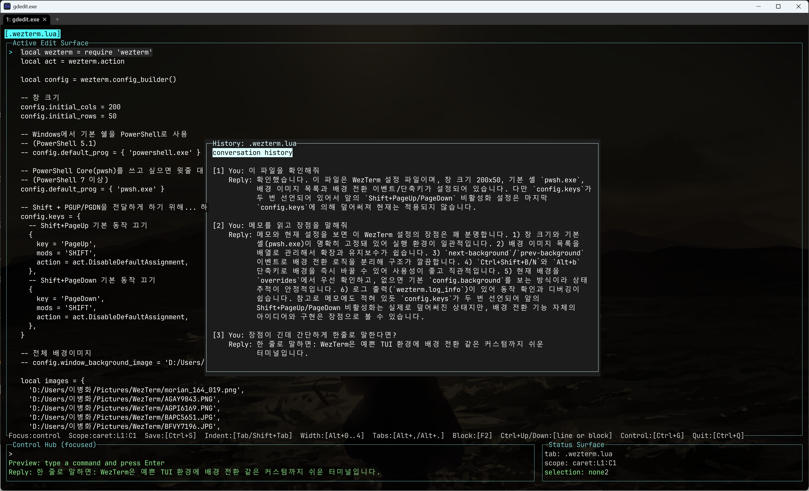

# gdedit

AI 에이전트를 포함한 터미널 cowork editor 프로토타입이다. WezTerm 같은 현대적인 터미널을 권장하지만, 현재 구현은 tmux/ssh 환경도 고려한 보수적인 키맵으로 정리되어 있다.

## What It Is

`gdedit` is an editing-first terminal editor.

- Open and edit ordinary files.
- Use the Control Hub for AI-assisted inspection, editing, memo capture, and slash commands.
- Keep per-file conversation history with `F3`.
- Edit external resources through subprocess sync without teaching `gdedit` the target system's schema or storage.

## Release Target

- Current release target: `v0.3.0`
- Core focus: editing-first terminal assistance, per-file Control Hub history, scoped memo routing, and release automation through GitHub Actions + GoReleaser.

## Screenshot



The screenshot shows the editing-first layout: active file buffer on the left, Control Hub at the bottom, Status Surface on the right, and per-file conversation history in the `F3` popup.

## Quick Start

### Open and edit a file

```bash
gdedit README.md
```

If the file does not exist yet, `gdedit` opens an empty file-backed tab and creates the file when you save with `Ctrl+S`.

### Start with a scratch buffer

```bash
gdedit
```

### Check configuration and agent readiness

```bash
gdedit --doctor
```

### Use the Control Hub

- Press `Ctrl+G` to focus the Control Hub.
- Type natural-language requests like `inspect this file` or `메모를 추가해줘 -> -.중요 설정`.
- Type slash commands like `/open`, `/write`, or `/sync` for direct editor actions.

## Typical Workflow

1. Open a file with `gdedit <file>`.
2. Edit text normally in the main surface.
3. Press `Ctrl+G` to move into the Control Hub.
4. Ask for inspection, add a memo, or run a slash command.
5. Press `Ctrl+S` to save.
6. Press `F3` when you want to review the conversation history for the current file.

## Common Controls

| Area | Keys | Behavior |
|------|------|----------|
| help / quit | `F1`, `Ctrl+Q` | open help, open quit confirmation |
| history | `F3` | open conversation history for the active tab |
| tabs | `Alt+.`, `Alt+,` | next tab, previous tab |
| select all | `Ctrl+A` | select all in the active surface |
| clipboard | `Ctrl+C`, `Ctrl+X`, `Ctrl+V` | copy, cut, paste, or replace current selection |
| text selection | `Shift+Arrow`, `Alt+Arrow`, `Shift+Alt+Arrow` | expand or shrink selection |
| line / page selection | `Shift+Home/End`, `Alt+Home/End`, `Shift/Alt+PageUp/PageDown` | extend selection to line edges or by page |
| word movement | `Ctrl+Left/Right` | move caret by word |
| word selection | `Ctrl+Alt+Left/Right`, `Ctrl+Shift+Left/Right`, `Ctrl+Shift+Alt+Left/Right` | extend selection by word |

## Current Editor Controls

| Area | Keys | Behavior |
|------|------|----------|
| focus | `Ctrl+G` | focus the Control Hub |
| indentation | `Alt+0..4` | set selection indentation mode and width |
| no selection | `Tab` | insert a literal tab |
| with selection | `Tab`, `Shift+Tab` | indent or outdent the selected lines |
| structure | `F2` | select current block, then parent block |
| page movement | `PageUp/PageDown` | move caret by larger vertical steps |
| no selection | `Ctrl+Up`, `Ctrl+Down` | remove or insert a blank line above |
| with selection | `Ctrl+Up`, `Ctrl+Down` | move the selected block up or down |
| save | `Ctrl+S` | save the current file-backed tab |

## Current Control Hub Controls

| Area | Keys | Behavior |
|------|------|----------|
| focus | `Ctrl+G`, `Esc` | enter or leave the Control Hub |
| word movement | `Ctrl+Left/Right` | move by word inside the one-line command |
| word selection | `Ctrl+Alt+Left/Right` | extend selection by word inside the one-line command |
| clipboard | `Ctrl+C`, `Ctrl+X`, `Ctrl+V` | copy, cut, paste, or replace the current selection |
| command flow | `Enter` | run talk/inspect and slash file commands immediately; preview edit and memo commands first, then confirm on second press |

## Conversation History

- `F3` opens a history popup for the active tab only.
- Each file tab keeps its own prompt/reply history, so switching tabs switches conversation context too.
- Long history lines wrap to the popup width without `...` truncation.

## Slash File Commands

- `/open <path>` opens an existing file in a new tab, or opens a file-backed empty tab for a missing path.
- `/sync <id> <name>` opens a subprocess-backed sync buffer using a registered sync id.
- `/write <path>` saves the current tab to the given path and updates the tab to that file.
- `/saveas <path>` is an alias for `/write <path>`.
- Quoted paths are supported, for example `/open "notes with spaces.txt"` and `/saveas "C:/Users/name/My Notes/todo.txt"`.
- If the target file is already open, `/open` switches to the existing tab instead of duplicating it.

## Process Sync

- Sync registrations live in `~/.config/gdedit/process_sync.json`.
- The goal is to let `gdedit` stay a raw text editor while external tools own loading, validation, and persistence.
- A sync entry defines two command formats: one for reading text into the buffer and one for writing the full buffer back through stdin.
- Use sync when the real source of truth is outside the filesystem, but the data can still be round-tripped as plain text.
- Register a sync target from the CLI:

```bash
gdedit --sync-register mynamr --read "mynamr rule show {name} --spec-only" --write "mynamr rule update {name} --spec-stdin"
```

- List registered sync entries:

```bash
gdedit --sync-list
```

- Remove a sync entry:

```bash
gdedit --sync-remove mynamr
```

- Open a registered sync buffer from the CLI:

```bash
gdedit --sync mynamr demo-rule
```

- Open the same target from the Control Hub:

```text
/sync mynamr demo-rule
```

- `{name}` is replaced with the target name at load/save time.
- Save still uses `Ctrl+S`; file tabs write to disk, while sync-backed tabs send the full buffer through the configured write command on stdin.
- Recommended flow:
  1. register one sync id with `--sync-register`
  2. verify it with `--sync-list`
  3. open a target via `gdedit --sync <id> <name>` or `/sync <id> <name>`
  4. edit raw text in the buffer
  5. press `Ctrl+S` to send the full buffer back through the write command

Example use case:

- `mynamr` owns the actual rule storage and validation.
- `gdedit` just loads the raw spec into a text buffer, lets you edit it, and writes the full text back over stdin on save.

## Memo Notes

- Natural-language memo requests still save readable bullet lists.
- Use `-.` inside one-line memo input to force a new stored detail line.
- Example: `이 설정을 메모해줘 shell은 pwsh 유지 -. 배경 이미지는 유지 -. 키 바인딩은 재검토`
- Scope routing follows the current file target:
  - project file -> `<workspace>/.gdedit/memos/...`
  - app file -> `memoRoot/app/[app-name].md`
  - system file -> `memoRoot/system/[name].md`

## Selection Model

| Concept | Rule |
|--------|------|
| caret | moves without changing selection when no selection modifier is held |
| text selection | character-range selection between anchor caret and active caret |
| selection modifiers | `Shift`, `Alt`, and `Shift+Alt` are treated the same for selection expansion |
| structural edit projection | indentation and block movement operate on the lines covered by the text selection |
| clipboard behavior | copy/cut use the selected text; paste inserts at the caret or replaces the current selection |
| external clipboard | system clipboard is used when available; gdedit falls back to its internal clipboard otherwise |
| agent boundary | current scope is the collaboration boundary; line-level lock/proposal state is not part of the live model |
| mouse | terminal mouse selection is not part of gdedit's internal edit model |

## Indentation Policy

- Default selection indentation uses `2` spaces.
- `Alt+1` to `Alt+4` change the selection indentation width.
- `Alt+0` switches selection indentation to literal tab mode.
- `Tab` inserts a literal `\t` when there is no active selection.
- Stored literal tab characters render as a visible `»` marker with a distinct style so they can be distinguished from plain text.

## Edit Agent Config

- Global config lives at `~/.config/gdedit/config.json`.
- Project-local memo state belongs under each project's `.gdedit/` directory.
- App-related memo state belongs under `memoRoot/app/[app-name].md`.
- System-related memo state belongs under `memoRoot/system/[name].md`.
- `gdedit --doctor` now reports the loaded `memoRoot`, edit-agent role, provider, model, and API-key readiness.
- Control Hub confirm now executes the configured edit agent against the current scope and accepts either a scoped replacement or a message-only response.
- Live edit-agent requests now include memo context from the configured system memo root and the current project's `.gdedit/` directory when those files exist.

`config.json` example:

```json
{
  "memoRoot": "~/gdedit/",
  "editAgent": {
    "enabled": true,
    "role": "edit-agent",
    "provider": "openai",
    "model": "gpt-5.4",
    "apiKeyEnv": "OPENAI_API_KEY"
  }
}
```

What each field means:

- `memoRoot`: system/app memo root. `~` is expanded to your home directory and the path is normalized with a trailing `/`. App-related files are stored under `memoRoot/app/[app-name].md`, and other non-project machine-level files fall back to `memoRoot/system/[name].md`.
- `editAgent.enabled`: turns the external edit agent on or off.
- `editAgent.role`: label shown in `--doctor` and UI summaries. The default is `edit-agent`.
- `editAgent.provider`: currently `openai` is supported.
- `editAgent.model`: model name sent to the provider, for example `gpt-5.4`.
- `editAgent.apiKeyEnv`: environment variable name that stores the API key, for example `OPENAI_API_KEY`.
- `editAgent.baseURL`: optional custom OpenAI-compatible endpoint. Leave it out when using the default OpenAI API.

Defaults when the file does not exist:

```json
{
  "memoRoot": "~/gdedit/",
  "editAgent": {
    "enabled": true,
    "role": "edit-agent",
    "provider": "openai",
    "model": "gpt-5.4",
    "apiKeyEnv": "OPENAI_API_KEY"
  }
}
```

Practical setup flow:

1. Create `~/.config/gdedit/config.json`.
2. Set your API key in the shell, for example `OPENAI_API_KEY`.
3. Keep system and app memos under `memoRoot`; app-related files are stored under `memoRoot/app/[app-name].md`, and non-project system files are stored under `memoRoot/system/[name].md`.
4. Open a project normally; project-local memos are stored under that project's `.gdedit/` directory.
5. Run `gdedit --doctor` to confirm the config path, memo root, provider, model, and API-key readiness.

Example with a custom endpoint:

```json
{
  "memoRoot": "~/gdedit/",
  "editAgent": {
    "enabled": true,
    "role": "edit-agent",
    "provider": "openai",
    "model": "gpt-5.4",
    "apiKeyEnv": "OPENAI_API_KEY",
    "baseURL": "https://api.openai.com/v1"
  }
}
```

Verification:

```bash
gdedit --doctor
```

You should see the loaded config path plus fields like `memo_root`, `edit_agent_provider`, `edit_agent_model`, and `edit_agent_status`.
.
